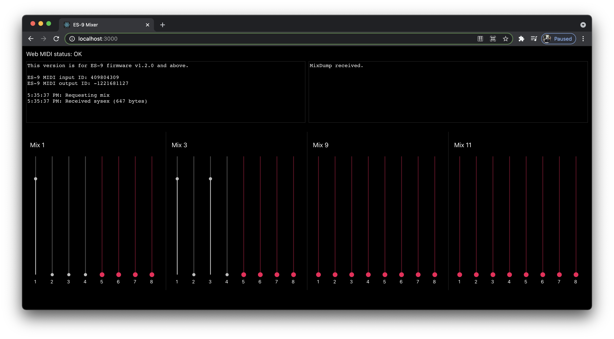

# ES-9 Mixer

Mixer for the Expert Sleepers [ES-9 USB audio
interface](https://www.expert-sleepers.co.uk/es9.html).

Intended as an alternative the ES-9 config tool when you just want to mix.

## Firmware

Requires firmware 1.2.0 or later which can be downloaded
[here](https://www.expert-sleepers.co.uk/es9firmware.html).

## Configuration

The following environment variables are supported:

`REACT_APP_HIDE_MIXES`: space delimited list of mixes you'd like to omit from
the UI.

`REACT_APP_DISABLE_CHANNELS`: space delimited `mix:channel` pairs that you'd
like to disable the slider input for.

### Example

Let's assume you only want to look at faders for your main out and headphones
mixes. Mix 1/2 and 9/10 are stereo linked and control main out. Mix 3/4 and
11/12 are stereo linked and they control headphone output. You may then want to
hide everything except mixes 1, 3, 9, and 11:

```
REACT_APP_HIDE_MIXES=2 4 5 6 7 8 10 12 13 14 15 16
```

Let's also assume that channels 1-4 on mixes 1 and 3 are USB inputs that you
always want at a certain level. You may want to disable them so they can't be
changed:

```
REACT_APP_DISABLE_CHANNELS=1:1 1:2 1:3 1:4 3:1 3:2 3:3 3:4
```

This would result in the following:



## Usage

Run this locally by first installing dependencies:

```
yarn install
```

Run server locally with:

```
yarn start
```
